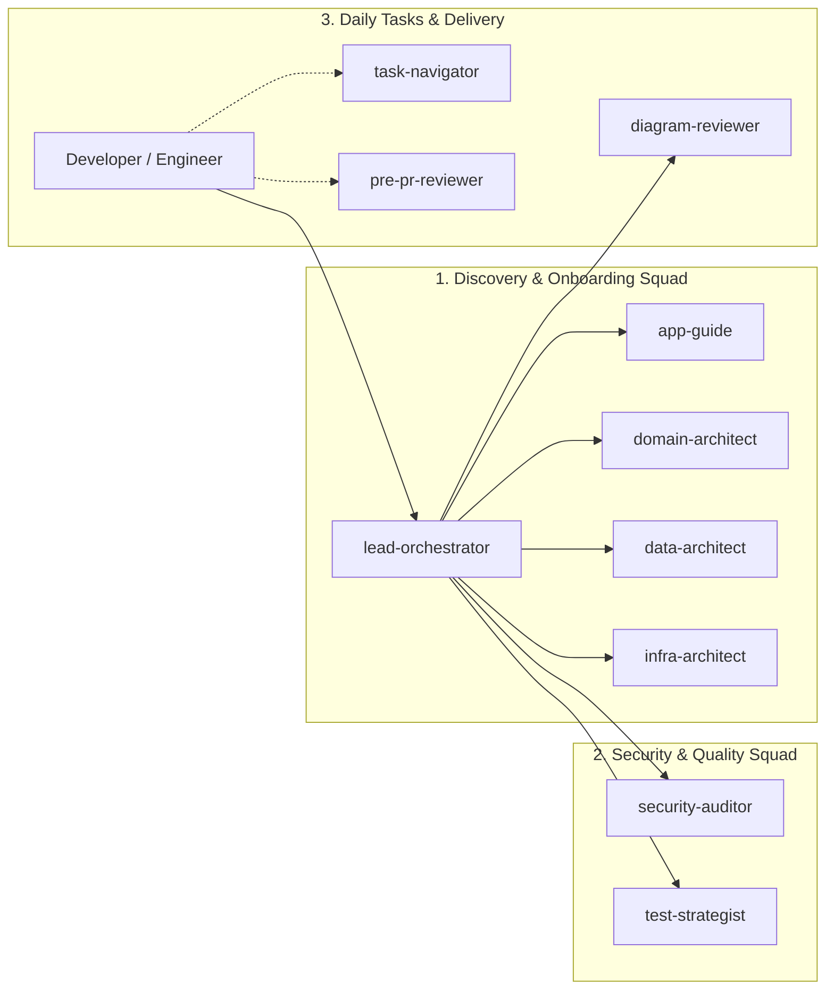

# Dev Buddies

> **Przenośny, wieloplatformowy pakiet wyspecjalizowanych subagentów AI (Google Antigravity & GitHub Copilot), zaprojektowany w celu skrócenia czasu wdrożenia dewelopera (*Developer Onboarding*) oraz asysty przy pierwszych zadaniach w nieznanym lub złożonym repozytorium.**

[](LICENSE)
[](https://antigravity.google)
[](https://github.com/features/copilot)
[](https://c4model.com)

---

## Filozofia: AI jako "Buddy", a nie Zastępstwo dla Programisty

Współczesne bazy kodu w firmach IT to dziesiątki powiązanych modułów, nieoczywiste reguły biznesowe i rozproszona wiedza. **Dev Buddies** rozwiązuje problem długiego wejścia w projekt (*Time-to-First-Commit*):

1. **Błyskawiczna Baza Wiedzy**: W kilka minut generuje kompletny portal wiedzy (`.agents/docs/`) oparty o standardy **C4 Model** oraz **Domain-Driven Design (DDD)**.
2. **Asystent Pierwszych Zadań**: Pomaga zrozumieć zakres zmian dla nowych tasków (wyznacza *Impact Vector* i plan implementacji krok po kroku).
3. **Pre-PR Sanity Check**: Działa jak lokalny Senior Buddy – pozwala sprawdzić kod przed oddaniem go do oficjalnego Code Review dla kolegów z zespołu.
4. **Pełna Kontrola Dewelopera**: Dokumentacja i agenci są narzędziem pomocniczym dla Ciebie. Gdy poznasz projekt, pracujesz samodzielnie bez narzutu.

---

## Zespół Subagentów (The Buddies Squad)

Zamiast jednego przeciążonego promptu, **Dev Buddies** dzieli pracę na wyspecjalizowane role zoptymalizowane pod kątem ekonomii kontekstu:



### Role i Odpowiedzialności:

| Subagent | Rola i Obszar Analizy | Plik Wynikowy |
|---|---|---|
| **`lead-orchestrator`** | Główny koordynator. Bada strukturę repo, zrównolegla pracę agentów i generuje spójny portal. | `.agents/docs/ONBOARDING_PORTAL.md` |
| **`app-guide`** | Architektura systemu w standardzie C4 (Container/Component), routing API, punkty startowe. | `.agents/docs/ARCHITECTURE.md` |
| **`domain-architect`** | Logika domenowa (DDD), słownik pojęć (*Ubiquitous Language*), maszyny stanów, inwarianty. | `.agents/docs/DOMAIN_AND_LOGIC.md` |
| **`data-architect`** | Bazy danych (SQL/NoSQL), modele ORM, diagram relacji ERD, indeksy, migracje. | `.agents/docs/DATA_MODEL.md` |
| **`infra-architect`** | Lokalne środowisko (Developer Runbook), zmienne `.env`, Docker Compose, seedowanie. | `.agents/docs/INFRA_SETUP.md` |
| **`security-auditor`** | Model Auth (JWT/OAuth), matryca uprawnień (RBAC/ABAC), middleware i wektory OWASP. | `.agents/docs/SECURITY_MODEL.md` |
| **`test-strategist`** | Piramida testów, komendy uruchomieniowe (Unit/E2E), mocki, fabryki danych i luki w QA. | `.agents/docs/TEST_STRATEGY.md` |
| **`task-navigator`** | Asystent tasków: analiza wpływu (*Task Impact Vector*), plan krok po kroku (TDD). | `.agents/docs/TASK_IMPACT.md` |
| **`pre-pr-reviewer`** | Lokalny partner przed wystawieniem PR: analiza Conventional Comments, wykrywanie regresji. | `.agents/docs/PRE_PR_REPORT.md` |
| **`diagram-reviewer`** | Linter diagramów Mermaid.js: formatowanie `graph LR`, spłaszczanie subgraphów. | Wszystkie pliki `.md` |

---

## Szybki Start

### 1. Inicjalizacja w Dowolnym Projekcie

Otwórz terminal w katalogu głównym projektu, w którym chcesz przeprowadzić onboarding:

#### Linux / macOS (Bash)
```bash
curl -sSL https://raw.githubusercontent.com/thenessar/dev-buddies/main/init.sh | bash
```
*(Aby automatycznie zainstalować instrukcje dla GitHub Copilot, dodaj flagę `--copilot`)*.

#### Windows (PowerShell)
```powershell
irm https://raw.githubusercontent.com/thenessar/dev-buddies/main/init.ps1 | iex
```
*(Lub pobierz i uruchom lokalnie `.\init.ps1 -Copilot`)*.

---

## Sposób Użycia

### Środowisko Google Antigravity

1. **Generowanie Pełnego Onboardingu**:  
   W oknie czatu Antigravity wywołaj:
   ```text
   @lead-orchestrator Zbuduj dla mnie pełny portal onboardingowy dla tego repozytorium.
   ```
2. **Pomoc w Pierwszym Zadaniu**:  
   Gdy dostajesz pierwsze zgłoszenie:
   ```text
   @task-navigator Chcę zrealizować zadanie: "Dodaj pole NIP firmy i generowanie faktur PDF". Przygotuj dla mnie plan i listę plików.
   ```
3. **Sprawdzenie Kodu Przed Wystawieniem PR**:  
   Po skończonej pracy nad kodem:
   ```text
   @pre-pr-reviewer Przejrzyj moje lokalne zmiany przed oddaniem ich do review zespołowi.
   ```

---

### Środowisko GitHub Copilot (VS Code / JetBrains)

1. **Natywni Agenci VS Code (`.github/agents/`)**:  
   Skrypty `init.sh --copilot` / `init.ps1 -Copilot` automatycznie instalują agentów w katalogu `.github/agents/*.agent.md`. W VS Code możesz wywołać ich bezpośrednio w trybie **Copilot Agent Mode** (np. `@lead-orchestrator`, `@task-navigator`).
2. **Instrukcje Globalne**:  
   Plik `.github/copilot-instructions.md` instruuje Copilota, aby zawsze traktował `.agents/docs/` jako źródło prawdy o architekturze.
3. **Szablony Promptów**:  
   Dodatkowe gotowe prompty znajdziesz w [`.github/prompt-templates.md`](.github/prompt-templates.md).

---

## Struktura Repozytorium

```text
dev-buddies/
├── .github/
│   ├── copilot-instructions.md   # Instrukcja globalna dla GitHub Copilot
│   ├── prompt-templates.md       # Szablony zapytań dla Copilot Chat
│   └── agents/                   # Natywne definicje agentów GitHub Copilot (*.agent.md)
│       ├── lead-orchestrator.agent.md
│       ├── app-guide.agent.md
│       ├── domain-architect.agent.md
│       ├── data-architect.agent.md
│       ├── infra-architect.agent.md
│       ├── security-auditor.agent.md
│       ├── test-strategist.agent.md
│       ├── task-navigator.agent.md
│       ├── pre-pr-reviewer.agent.md
│       └── diagram-reviewer.agent.md
├── agents/                       # Definicje agentów Google Antigravity
│   ├── lead-orchestrator.md
│   ├── app-guide.md
│   ├── domain-architect.md
│   ├── data-architect.md
│   ├── infra-architect.md
│   ├── security-auditor.md
│   ├── test-strategist.md
│   ├── task-navigator.md
│   ├── pre-pr-reviewer.md
│   └── diagram-reviewer.md
├── templates/                    # Szablony wyjściowe Markdown (C4 & Diátaxis)
│   ├── ONBOARDING_PORTAL.md
│   ├── ARCHITECTURE.md
│   ├── DOMAIN_AND_LOGIC.md
│   ├── DATA_MODEL.md
│   ├── INFRA_SETUP.md
│   ├── SECURITY_MODEL.md
│   ├── TEST_STRATEGY.md
│   ├── TASK_IMPACT.md
│   └── PRE_PR_REPORT.md
├── examples/                     # Przykłady wygenerowanej dokumentacji (Showcase)
│   └── databricks-lakehouse/     # Przykład dla platformy Azure Databricks (Medallion + DABs + MLflow + Power BI)
├── rules/
│   └── global-constraints.md     # Globalne zasady jakości, budżetu kontekstu i Mermaid
├── .buddiesrc.yaml.example       # Przykładowy plik konfiguracyjny projektu
├── init.sh                       # Instalator Linux / macOS
├── init.ps1                      # Instalator Windows PowerShell
├── LICENSE                       # Licencja MIT
└── README.md
```

---

## 🌟 Przykładowe Wyjście (Showcase)

W katalogu [`examples/databricks-lakehouse/`](examples/databricks-lakehouse/) znajdziesz kompletną, gotową dokumentację onboardingową przygotowaną dla zaawansowanej platformy danych klasy Enterprise:
- **Architektura**: Medallion Lakehouse (Bronze / Silver / Gold Delta Lake) w Unity Catalog.
- **Orkiestracja**: Databricks Asset Bundles (DABs) + Azure DevOps CI/CD + Terraform.
- **MLOps & BI**: Rejestr modeli MLflow, batch inference oraz automatyczne odświeżanie raportów Power BI.

---

## Licencja

Projekt udostępniany na licencji **MIT** – gotowy do swobodnego użycia w projektach komercyjnych, open-source oraz wewnętrznych repozytoriach firmowych.
