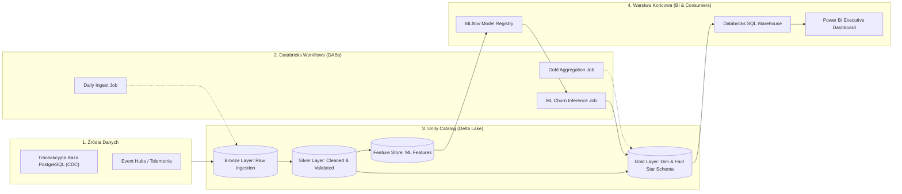
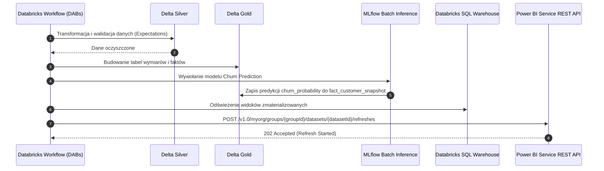

# Architektura Systemu & Medallion Lakehouse

## 1. Podsumowanie Architektoniczne
- **Główny Stos**: Azure Databricks (Runtime 15.x LTS / Apache Spark 3.5), Delta Lake 3.x, Python 3.11, Unity Catalog.
- **Orkiestracja**: Databricks Workflows zarządzane deklaratywnie przez **Databricks Asset Bundles (DABs)**.
- **MLOps**: MLflow Model Registry w Unity Catalog (`prod.ml_models.customer_churn_xgboost`), Batch Inference Jobs.
- **Warstwa BI**: Azure Databricks Serverless SQL Warehouse podłączony bezpośrednio do Power BI Semantic Models (DirectQuery / Scheduled Import).
- **IaC & CI/CD**: Terraform (zarządzanie workspace, metastore, storage containers) + Azure DevOps Multi-Stage Pipelines.

---

## 2. Struktura Repozytorium i Modułów
| Katalog / Plik | Odpowiedzialność Inżynieryjna |
|---|---|
| [`databricks.yml`](file:///...) | Główna definicja Databricks Asset Bundle (środowiska: `dev`, `staging`, `prod`) |
| [`src/pipelines/bronze_ingestion/`](file:///...) | Zadania Auto Loader odczytujące surowy JSON/Parquet z ADLS Gen2 do tabel Bronze |
| [`src/pipelines/silver_transform/`](file:///...) | Oczyszczanie, normalizacja, deduplikacja, nakładanie reguł jakości danych |
| [`src/pipelines/gold_analytics/`](file:///...) | Tworzenie modelu gwiazdy (Star Schema), agregacje biznesowe i Feature Store |
| [`src/ml/`](file:///...) | Trening modeli MLflow, walidacja metryk i batch inference |
| [`src/bi/powerbi_refresh/`](file:///...) | Skrypt wyzwalający odświeżenie datasetu Power BI przez REST API po zakończeniu pipeline'u Gold |
| [`terraform/`](file:///...) | Konfiguracja zasobów chmurowych Azure (Resource Groups, Storage, Databricks Workspace) |
| [`azure-pipelines.yml`](file:///...) | Pipeline CI/CD: linting, testy `pytest`, walidacja DABs (`bundle validate`) i deploy (`bundle deploy`) |

---

## 3. Diagram Architektury Przepływu Danych (Medallion Architecture)

---

## 4. Przepływ Publikacji Danych do Power BI (Sequence Diagram)

---

## 5. Kluczowe Punkty Wejścia Pipeline'ów
- **Główny Pipeline Danych**: [`src/pipelines/main_etl.py`](file:///...)
- **Batch Inference ML**: [`src/ml/batch_inference.py`](file:///...)
- **Wyzwalacz Power BI**: [`src/bi/powerbi_refresh/trigger_refresh.py`](file:///...)
