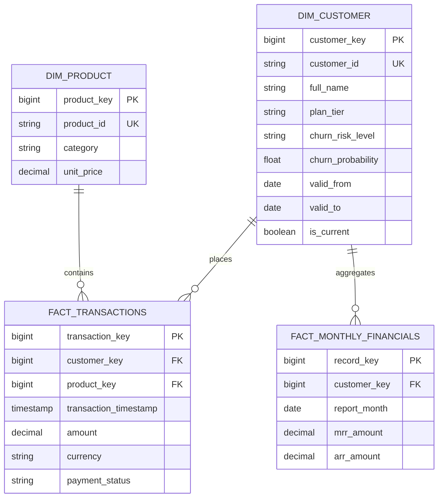

# Model Danych & Schemat Unity Catalog

## 1. Struktura Katalogów i Schematów Unity Catalog

- **Metastore**: `azure_westeurope_metastore`
- **Katalog Główny**: `lakehouse_prod` (oraz `lakehouse_dev` dla środowisk deweloperskich)
- **Format Plików**: Delta Lake z włączonym Liquid Clustering lub Partitioning po dacie

```text
lakehouse_prod
├── bronze
│   ├── raw_app_users (Delta)
│   ├── raw_transactions (Delta)
│   └── raw_telemetry_events (Delta)
├── silver
│   ├── cleaned_customers (Delta)
│   ├── cleaned_transactions (Delta)
│   └── cleaned_subscriptions (Delta)
└── gold
    ├── dim_customer (Delta, SCD2)
    ├── dim_product (Delta)
    ├── fact_transactions (Delta, Clustered by transaction_date)
    └── fact_monthly_financials (Delta)
```

---

## 2. Diagram Związków Tabel Gold (Star Schema ERD)



---

## 3. Liniowość Danych (Data Lineage & Feature Store)

- **Feature Store (`lakehouse_prod.features.customer_features`)**:
  - `avg_transaction_val_30d` <- Obliczane z `silver.cleaned_transactions`
  - `login_frequency_7d` <- Obliczane z `silver.cleaned_telemetry_events`
  - `days_since_last_payment` <- Obliczane z `silver.cleaned_subscriptions`
- **Konsument Cech**: Model ML Churn XGBoost (`prod.ml_models.customer_churn_xgboost`).
- **Wynik**: Zapis do `gold.dim_customer.churn_probability`.
