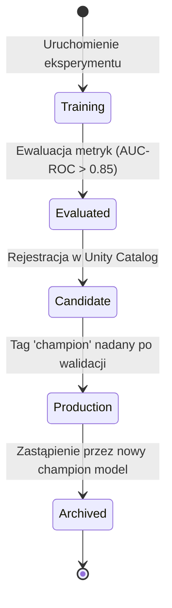

# Logika Domenowa & Słownik Pojęć Analitycznych

## 1. Słownik Pojęć Biznesowych (Ubiquitous Language)

| Pojęcie Biznesowe | Odpowiednik w Lakehouse | Opis i Znaczenie Domenowe |
|---|---|---|
| **MRR (Monthly Recurring Revenue)** | `gold.fact_monthly_financials.mrr_amount` | Miesięczny przychód cykliczny z aktywnych subskrypcji |
| **Customer Churn Risk** | `gold.dim_customer.churn_risk_level` | Klasyfikacja ryzyka odejścia (`LOW`, `MEDIUM`, `HIGH`, `CRITICAL`) wyznaczana przez model ML |
| **Active Customer** | `gold.dim_customer.is_active` | Klient z aktywną subskrypcją lub transakcją w ostatnich 30 dniach |
| **SCD Type 2 (Historyczność)** | `gold.dim_customer` (kolumny `valid_from`, `valid_to`, `is_current`) | Śledzenie zmian danych klienta (np. zmiana planu cenowego) w czasie |

---

## 2. Inwarianty Jakości Danych (Delta Live Tables / Data Quality Expectations)

| ID Reguły | Warunek Jakościowy | Poziom Restrykcji | Miejsce Egzekwowania |
|---|---|---|---|
| `[DQ-01]` | `customer_id IS NOT NULL` | **FAIL / DROP** | [`src/pipelines/silver_transform/customers.py`](file:///...) |
| `[DQ-02]` | `transaction_amount >= 0.00` | **FAIL / DROP** | [`src/pipelines/silver_transform/transactions.py`](file:///...) |
| `[DQ-03]` | `valid_to >= valid_from` | **FAIL / QUARANTINE** | [`src/pipelines/gold_analytics/dim_customer.py`](file:///...) |
| `[DQ-04]` | `churn_probability BETWEEN 0.0 AND 1.0` | **WARN** | [`src/ml/batch_inference.py`](file:///...) |

---

## 3. Cykl Życia Modelu ML (MLflow Model Governance)

---

## 4. Zasady Odświeżania Power BI & SLA
- **Częstotliwość Odświeżania**: Codziennie o godzinie 06:00 UTC (po zakończeniu nocnego wsadu Gold i inferencji ML).
- **Maksymalny Dopuszczalny Czas Wykonania ETL**: 45 minut.
- **Strategia Odświeżania**: Wywołanie Power BI Enhanced Refresh API dla poszczególnych partycji tabel faktów (`fact_daily_revenue`).
