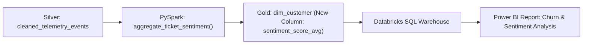

# Plan Realizacji Zadania & Analiza Wpływu (Task Impact Vector)

## 1. Podsumowanie Zadania
> **Zgłoszenie**: `DATA-412: Dodanie wskaźnika Customer Sentiment Score do tabeli Gold i odświeżenie raportu Power BI`  
> **Kluczowy Cel**: Rozszerzenie tabeli `gold.dim_customer` o kolumnę `sentiment_score_avg` wyliczaną na podstawie transkrypcji zgłoszeń z supportu oraz dodanie miary do Semantic Model w Power BI.

---

## 2. Precyzyjna Lista Plików do Modyfikacji / Utworzenia

| Status | Plik | Funkcja / Element | Zakres Modyfikacji |
|---|---|---|---|
| `[MODIFY]` | [`src/pipelines/silver_transform/telemetry.py`](file:///...) | `aggregate_ticket_sentiment()` | Parsowanie sentymentu zgłoszenia z surowego payloadu |
| `[MODIFY]` | [`src/pipelines/gold_analytics/dim_customer.py`](file:///...) | `build_dim_customer()` | Dołączenie `sentiment_score_avg` w złączeniu `LEFT JOIN` |
| `[MODIFY]` | [`databricks.yml`](file:///...) | `gold_aggregation_job` | Aktualizacja definicji parametrów zadania w DABs |
| `[MODIFY]` | [`powerbi/models/CustomerAnalytics.pbip`](file:///...) | `DimCustomer` | Dodanie nowej miary DAX `Average Customer Sentiment` |
| `[NEW]` | [`tests/unit/test_sentiment_aggregation.py`](file:///...) | `test_sentiment_null_handling()` | Test jednostkowy sprawdzający brakujące oceny sentymentu |

---

## 3. Przepływ Zmiany w Danych (Data Flow)

---

## 4. Plan Implementacji Krok po Kroku

### Krok 1: Transformacja w Warstwie Silver & Testy
1. Zmodyfikuj funkcję `aggregate_ticket_sentiment` w `src/pipelines/silver_transform/telemetry.py`.
2. Napisz i uruchom test jednostkowy: `pytest tests/unit/test_sentiment_aggregation.py`.

### Krok 2: Zasilenie Tabeli Gold
1. Dodaj kolumnę `sentiment_score_avg FLOAT` w `src/pipelines/gold_analytics/dim_customer.py`.
2. Zweryfikuj wsteczną kompatybilność schematu Delta (opcja `.option("mergeSchema", "true")` przy zapisie).

### Krok 3: Walidacja Paczki DABs i Wdrożenie Dev
1. Sprawdź poprawność wiązki: `databricks bundle validate --target dev`.
2. Wdróż do swojego piaskownicy: `databricks bundle deploy --target dev`.
3. Przetestuj uruchomienie zadania: `databricks bundle run gold_aggregation_job --target dev`.

### Krok 4: Aktualizacja Raportu Power BI
1. Otwórz `powerbi/models/CustomerAnalytics.pbip` w Power BI Desktop, zsynchronizuj schemat `dim_customer` i dodaj miarę DAX.

---

## 5. Potencjalne Skutki Uboczne & Ryzyka
- [ ] **Wydajność złączenia (Shuffle Spill)**: Upewnij się, że agregacja po `customer_id` nie powoduje data skew przy klientach korporacyjnych (użyj `salting` w razie potrzeby).
- [ ] **Schema Drift w Power BI**: Jeśli raport Power BI używa importu scheduled, upewnij się, że nowa kolumna nie zepsuje istniejących wizualizacji przed wdrożeniem modelu.
