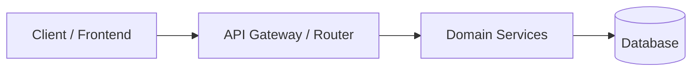
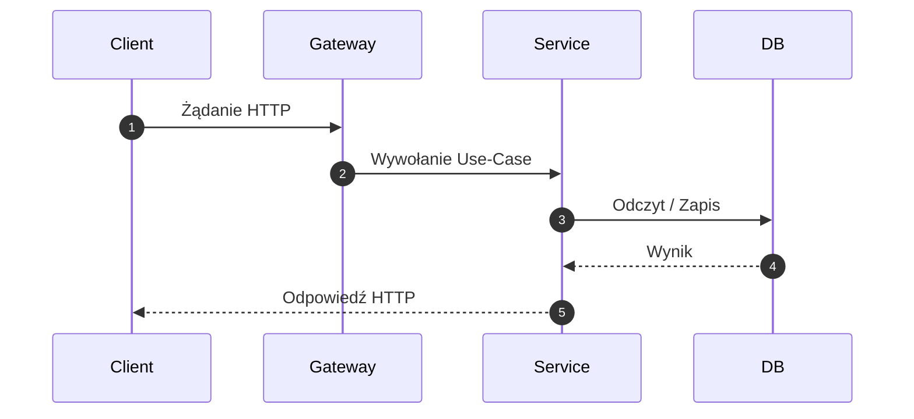

# Architektura Systemu & Mapa API

## 1. Podsumowanie Architektoniczne
- **Framework & Narzędzia**: [np. Node.js + TypeScript + Express / NestJS]
- **Wzorzec Architektoniczny**: [np. Clean Architecture / Layered / Hexagonal]
- **Główne Punkty Wejścia**: [`src/main.ts`](file:///...)

---

## 2. Kluczowe Moduły Systemu
| Moduł / Katalog | Odpowiedzialność |
|---|---|
| [`src/modules/...`](file:///...) | [Opis modułu] |

---

## 3. Diagram Architektury (C4 Container View)

---

## 4. Mapa Routingu API
| Metoda | Ścieżka | Kontroler / Handler | Autoryzacja | Opis |
|---|---|---|---|---|
| `GET` | `/api/v1/...` | `Controller.action` | Role | [Opis] |

---

## 5. Przepływ Żądania (Sequence Diagram)

