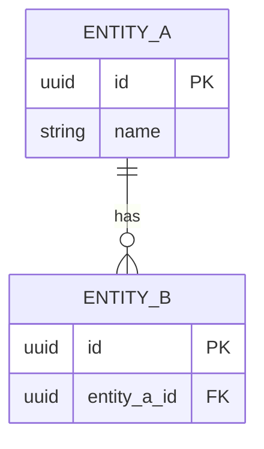

# Model Danych & Schemat Bazy

## 1. Stos Technologiczny Warstwy Danych
- **Silnik Bazy Danych**: [np. PostgreSQL / MySQL / MongoDB]
- **ORM / Migracje**: [np. Prisma / TypeORM / Drizzle]

---

## 2. Diagram ERD (Entity Relationship Diagram)

---

## 3. Kluczowe Tabele i Modele
### Tabela: `[nazwa_tabeli]`
- **Model**: [`src/models/...`](file:///...)
- **Klucz Główny (PK)**: `id`
- **Indeksy**: `idx_...`
