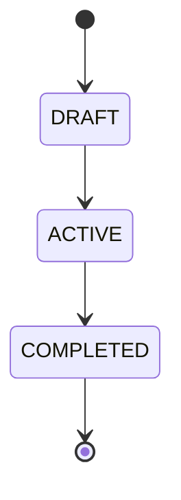

# Logika Domenowa & Słownik Pojęć (DDD)

## 1. Słownik Pojęć Biznesowych (Ubiquitous Language)
| Pojęcie Biznesowe | Odpowiednik w Kodzie | Opis i Znaczenie Domenowe |
|---|---|---|
| [Pojęcie] | `Class / Enum` | [Opis znaczenia] |

---

## 2. Maszyny Stanów (Lifecycle State Diagrams)

---

## 3. Inwarianty i Twarde Reguły Biznesowe
| ID | Nazwa Reguły | Miejsce w Kodzie | Opis |
|---|---|---|---|
| `[BR-01]` | [Nazwa] | [`src/...`](file:///...) | [Warunek walidacji] |

---

## 4. Zdarzenia Domenowe & Integracje
- **Eventy**: [np. `OrderCreated`, `UserDeactivated`]
- **Dostawcy**: [np. Stripe, SendGrid, Twilio]
