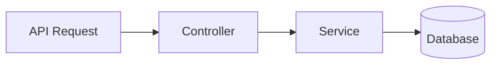

# Plan Realizacji Zadania & Analiza Wpływu

## 1. Podsumowanie Zadania
> [Treść zgłoszenia / cel wdrożenia]

---

## 2. Lista Plików do Modyfikacji
| Status | Plik | Funkcja / Klasa | Zakres Zmiany |
|---|---|---|---|
| `[MODIFY]` | [`src/...`](file:///...) | `...` | ... |

---

## 3. Przepływ Zmiany (Mermaid)

---

## 4. Plan Implementacji Krok po Kroku
1. **Modele & Migracje**: ...
2. **Logika Biznesowa**: ...
3. **Testy & Weryfikacja**: ...
